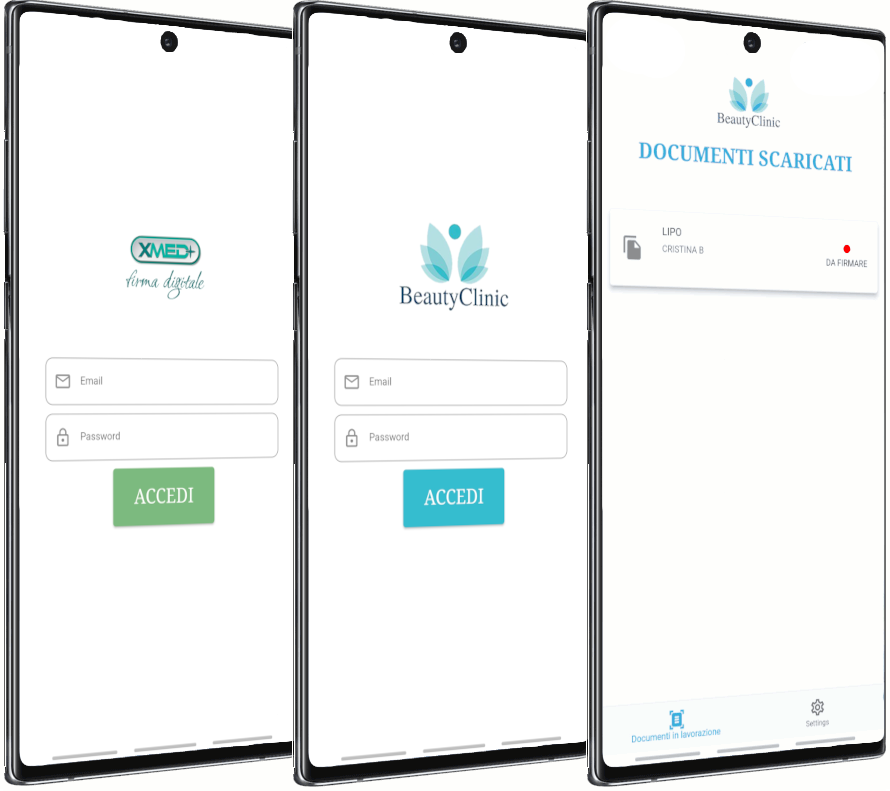

# xMed

>[!NOTE]
>Please note that the project is currently not fully operational due to the redaction of certain content, which has temporarily limited its functionality. Additionally, some components of this application rely on third-party libraries that require specific credentials for access. Regrettably, I'm unable to share these credentials as they are subject to confidentiality agreements and security considerations. 

## Abstract
Durante il percorso di stage ho lavorato alla creazione di un’applicazione destinata a cliniche mediche private e focalizzata sulla raccolta del consenso informato. Il suo scopo è permettere al personale di porgere al paziente un tablet, con il quale quest’ultimo possa consultare il documento relativo all’operazione che si presta a subire, e firmarlo per acconsentire al trattamento.

L’intero processo prende il nome di acquisizione del consenso informato, che è un documento di valore legale che tutela gli attori coinvolti, pazienti e medici, da errori o incomprensioni che possono risultare in seguito a operazioni medico chirurgiche. Il procedimento rappresenta quindi uno dei passi fondamentali del percorso terapeutico di un paziente. Esso produce però uno o più documenti cartacei che possono comportare, per cliniche specializzate in interventi chirurgici, un costo non indifferente se considerate le attività di stoccaggio, archiviazione e ricerca. Sempre più cliniche mediche valutano quindi la digitalizzazione dell’intera procedura tentate dalla riduzione dei costi di gestione, fino anche a un decimo.

Essendo il documento di natura legale è sottoposto a una normativa, per essere considerato valido nella sua versione digitale, necessita di una Firma Elettronica Avanzata. Durante lo sviluppo ho utilizzato la tecnologia della Firma Grafometrica, che associa alla rappresentazione grafica del tratto, informazioni biometriche volte a identificare univocamente la firma alla persona.

## UI

